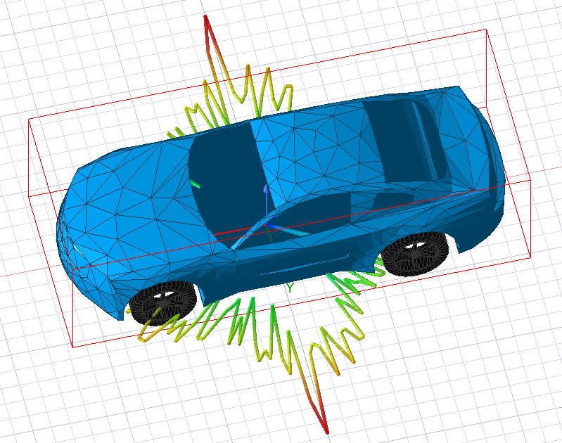
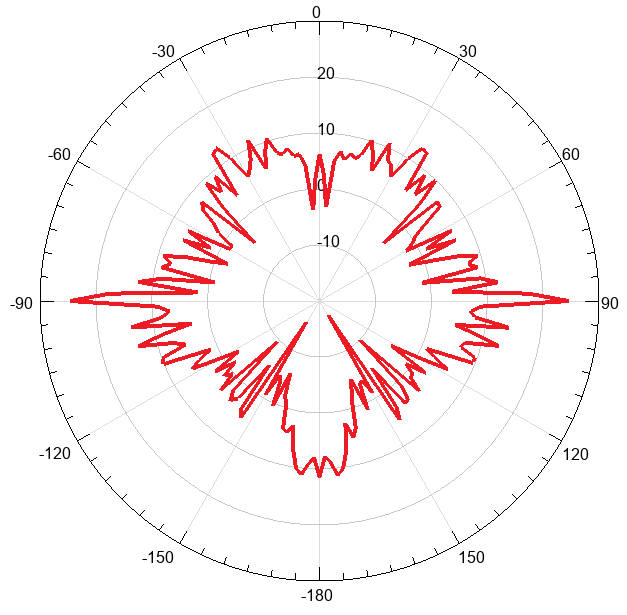
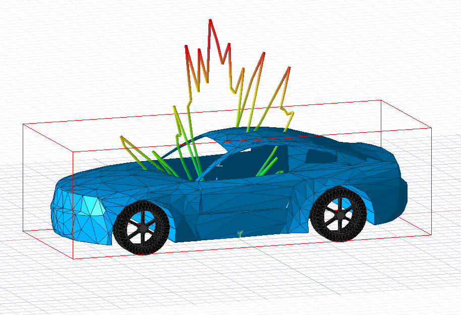
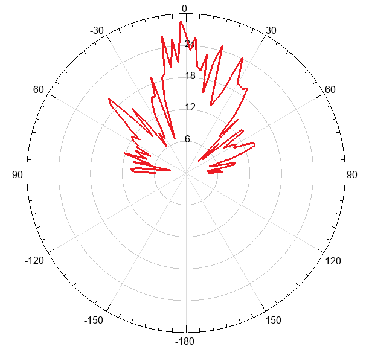

# Отчет к лекции №5

---

## Конспект  

### Методы расчета антенн в Ansys HFSS  

**Метод конечных элементов** (FE -- Finite Element) -- вычисляет ЭМ поля  
в объеме, используется с граничными условиями вокруг области  
(ограниченная область анализа). Моделируемая структура окружается  
граничным условием и все пространство моделирования внутри может быть  
разбито на сетку, внутри элементов сетки решается система уравнений  
Максвелла, потом они сшиваются.  

**Метод интегральных уравнений** (IE -- Integral Equation) -- токи и  
поля рассчитываются на поверхности, хорошо подходит для моделирования  
больших металлических структур. При его использовании создается не  
объемная сетка внутри обрасти анализа, а двумерная сетка на  
поверхностях, которые им анализируются.  

**Гибридные регионы FE-BI** -- комбинация FE и IE, когда структура  
рассчитывается методом конечных элементов и поле проецируется за пределы  
области анализа. Так можно рассчитывать структуры с разными граничными  
условиями, взаимодействующие между собой. Например, антенна  
рассчитывается методом конченых элементов (FE) и окружается граничным  
условием, сетка рассчитывается подробно, а какая-либо большая структура  
(напр. отражатель) решается с помощью IE-решателя. Комбинированный  
подход позволяет экономить вычислительные ресурсы.  

**SBR+** (Shooting & Bouncing Rays) учитывает не только лучевую модель,  
но и взаимодействие с поверхностью. Позволяет моделировать токи с учетом  
их переотражения на границах моделируемых структур. Этот метод соединяет  
в себе четыре разных метода: когда луч взаимодействует с поверхностью,  
запускаются дополнительные математические и электродинамические аппараты  
анализа. Позволяет решать задачи в промежуточной области анализа. По  
сравнению с методом интегральных уравнений дает большую точность.  

---

## Расчет рассеяния автомобиля 

**Модель автомобиля:** `car_model.step`. Материал тела автомобиля -- Perfect E  
(идеальный проводник), колеса не учитываются (Non Model). Расчет  
производится в ограниченной области Open Region (Boundary -- Radiation).  

**139 вариант** -- Solution Freq **1139** MHz. Источник излучения --- Plane  
Incident Wave. Параметры:  

- **Расчет в горизонтальной плоскости:**  
  Phi 0 -- 360 deg, step 2 deg; Theta 90 deg; Eo Phi 0, Eo Theta 1; Origin  
  0,0,0; Type Propagating.  

- **Расчет в вертикальной плоскости:**  
  Phi 180 deg; Theta -90 -- 90 deg, step 2 deg; Eo Phi 1, Eo Theta 0;  
  Origin 0,0,0; Type Propagating.  

  

  

---

## Что такое ЭПР? 

ЭПР (эффективная площадь/поверхность рассеяния) --- это радиотехническая  
характеристика объекта, которая показывает, насколько хорошо он отражает  
радиоволны в направлении радиолокатора.  

ЭПР определяет условную площадь, которая, будучи помещенной в точку  
расположения цели, создаёт в месте расположения антенны РЛС ту же  
плотность потока мощности, что и реальная цель.  

**Факторы, влияющие на ЭПР:**  

1. Геометрия объекта -- форма, размеры, углы поверхностей. Например,  
   плоские и угловые поверхности могут сильно отражать сигнал. Однако  
   это можно применить и для скрытия с радара. Например F-117 Nighthawk  
   имеет очень угловатую форму и спроектирован так, чтобы большинство  
   отражений уходило вверх или вбок, а не к вражескому радару.  

2. Материал покрытия -- радиопоглощающие материалы снижают ЭПР.  
   Например, на F-22 и F-35 наносится специальная радиопоглащяющая  
   краска;  

3. Длина волны радара -- ЭПР зависит от соотношения размера объекта и  
   длины волны;  

4. Угол облучения -- ЭПР меняется при изменении ракурса.  

**Какую информацию даёт ЭПР?**  

1. Обнаружение цели -- чем больше ЭПР, тем дальше радар может засечь  
   объект (птица: ~0,01 м², человек: ~1 м², автомобиль: ~10--100 м²,  
   истребитель: ~0,1--10 м² (не стелс), корабль: ~1000--100 000 м²);  

2. Идентификация объекта -- по динамике изменения ЭПР можно определить  
   тип цели (самолёт, БПЛА, корабль).  
